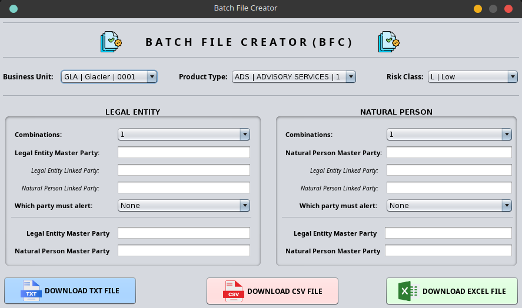

# Batch File Creator (BFC)

This is a small Java application that creates and generates a correctly formatted batch file with test data. I created this because I'm simply lazy to manually create these batch files.



## Project design

This project is split into three main parts.

- Front-end: Using JSwing application for GIU
- Scraping the [OFAC](https://sanctionssearch.ofac.treas.gov/) Sanctions List website using Selenium with Java
- Storing the Sanctions list test data into SQLite database

## Tech-stack for the project

-  NetBeans IDE 28
-  Java 25
-  SQLite3
-  Maven
-  Selenium 4
-  Git
-  Log4J
-  VSCode

## Execution

There are two ways one can run this project

- NetBeans 
    - Launch the jar file
    - Run it directly by clicking the **Run Project** button
- Selenium (**N.B.,** This will only be executed once as it creates test data and writes it into the database)
    - You can run the method **scrapeWebsite** by clicking on the *Run* icon next to the method
    - Run from testng.xml with the command **mvn test -DsuiteXmlFile=testng.xml**
        - **N.B.,** Depending on which party type you need, change the parameter in the testng.xml file. Expected parameter '*Entity*' or '*Individual*' 
    - Run using maven command **mvn test**

## Creating a build

I have created two self-executable files for two types of operating systems. One for Linux based distros and two, for MS Windows

- Linux build cator for all linux distros and the script will create a build for '*deb*', '*rpm*', '*dmg*' files.
    - Linux deb, rpm, dmg build package
        - For Red Hat Linux, the rpm-build package is required.
            - ```sudo dnf install rpm-build rpmdevtools```
        - For Ubuntu Linux, the fakeroot package is required.
    - Run the ```build-linux-installer.sh```

- MS Windows build script will build a '*exe*' file for both x86 and x64.
    - Install [wixtoolset](https://github.com/wixtoolset/wix/releases/). WiX is a set of build tools that build Windows Installer package
    - Run the ```build-windows-installer.bat```
    
## Icons

Icons used are from [flaticon](https://www.flaticon.com/) and [icon-icons](https://icon-icons.com/search?q=paper+stack&price=free&page=2&sort=popular)

- [excel](https://www.flaticon.com/free-icons/excel) icon
- [file type](https://www.flaticon.com/free-icons/file-type) icon
- [csv file](https://www.flaticon.com/free-icons/csv-file) icon
- [batch processing](https://www.flaticon.com/free-icons/batch-processing) icon
- [paper_stack](https://icon-icons.com/icon/base-data-document-office-page-paper/107782) icon

## Operating System used when developing application

This project is developed on a linux operating system. At the time of adding this information in the README file the below were the versions.

- Fedora Linux 43 - KDE Plasma Desktop Edition
- KDE Plasma Version: 6.5.5
- KDE Frameworks Version: 6.22.0
- Kernel Version: 6.18.5-200.fc43.x86_64 (64-bit)
- Graphics Platform: Wayland

